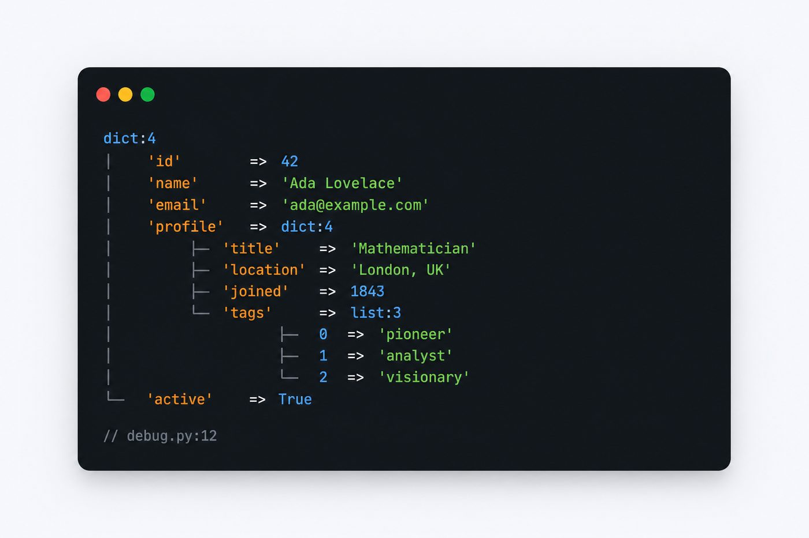
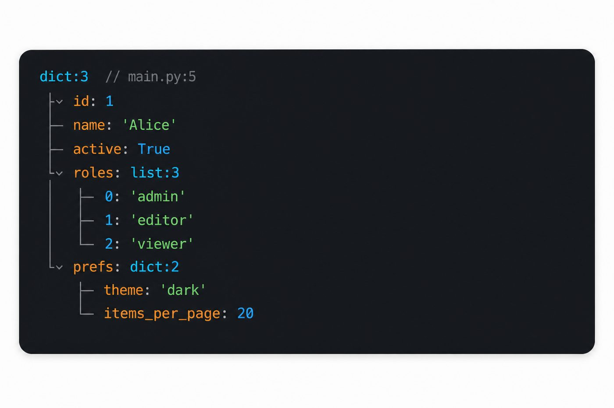

# pydump

<p align="center">
  
</p>

**Documentation:** [English](https://ardavanshamroshan.github.io/pydump/) · [فارسی](https://ardavanshamroshan.github.io/pydump/fa/)  
**PyPI:** [pydump-dd](https://pypi.org/project/pydump-dd/) · **GitHub:** [ardavanshamroshan/pydump](https://github.com/ardavanshamroshan/pydump)

Structured **dump and die** for Python scripts and CLIs. Stdlib only. No browser, no web framework required.

Inspect dicts, lists, objects, and scalars in the terminal with readable trees, ANSI colors (when stderr is a TTY), and `// file:line` call-site tips.

## Preview

<p align="center">
  
</p>

<p align="center">
  
</p>

```text
$ python debug.py

dict:4 [
  "id" => 1
  "author" => "Jane Doe"
  "title" => "Hello world"
  "tags" => list:3 [
    0 => "python"
    1 => "debug"
    2 => "pydump"
  ]
] // debug.py:12
```

Nested structures are **fully expanded** in the terminal — there is no collapse UI, so every level is printed.

## Introduction

`pydump` is the core debugging package in this family. Use it anywhere you run plain Python:

- scripts and one-off tools
- management commands
- tests and notebooks (careful with `dd()` — it exits)
- CI logs (`NO_COLOR=1` for plain text)

**pydd** builds on top of `pydump` for FastAPI, Flask, and Django (HTML dumps in the browser). Install `pydd` if you need both; install `pydump` alone if you only work in the terminal.

## Installation

PyPI name: **`pydump-dd`**. Import name: `pydump`. Standalone — no web deps.

```bash
pip install pydump-dd
```

### pip + venv

```bash
cd myapp
python -m venv .venv
source .venv/bin/activate        # Windows: .venv\Scripts\activate

pip install pydump-dd
python -m main
```

Example `main.py`:

```python
import pydump  # installs dd/dump as builtins (Laravel-style)

user = {"id": 1, "name": "Ada", "roles": ["admin", "editor"]}

dump(user)   # stderr, keep running — no from-import needed
dd(user)     # stderr, then exit 1
```

Or explicit import still works: `from pydump import dd, dump`.

Expected output:

```text
dict:3 [
  "id" => 1
  "name" => "Ada"
  "roles" => list:2 [
    0 => "admin"
    1 => "editor"
  ]
] // main.py:5
```

### uv

```bash
cd myapp
uv add pydump-dd
uv run main.py
```

`pyproject.toml`:

```toml
[project]
dependencies = ["pydump-dd>=0.2.2"]
```

### Install into the pydump repo itself (development)

```bash
cd /path/to/pydump
pip install -e .
# or
uv pip install -e ".[dev]"
uv run pytest -q
```

### Example project

See `../pyexample` for a minimal working setup (pip and uv).

## Usage

### Quick start

```python
from pydump import dd, dump

user = {"id": 1, "name": "Ada", "roles": ["admin", "editor"]}

dump(user)   # print to stderr, keep running
dd(user)     # print to stderr, then exit with code 1
```

### Multiple values

```python
from pydump import dd

dd(post, request_id=42, user=current_user)
```

Positional arguments each get a dump block. Keyword arguments are labeled.

### Render without side effects

```python
from pydump import render_text

text = render_text({"ok": True}, color=False)
log.debug(text)
```

### Configure project root for `//` tips

```python
from pathlib import Path
from pydump import configure, dd

configure(project_root=Path(__file__).resolve().parent)
dd(some_value)  # tips like // app/views.py:88
```

### Environment

| Variable | Effect |
|----------|--------|
| `NO_COLOR=1` | Disable ANSI colors |
| `FORCE_COLOR=1` | Force ANSI even when stderr is not a TTY |

## API

| Function | Description |
|----------|-------------|
| `dump(*args, **kwargs)` | Write formatted dump to **stderr**, continue execution |
| `dd(*args, **kwargs)` | Same as `dump`, then `SystemExit(1)` |
| `render_text(*args, color=None, **kwargs)` | Return dump string; no I/O, no exit |
| `configure(project_root=...)` | Base path for relative `// file:line` tips |
| `install_helpers()` | Inject `dd` / `dump` into builtins (auto on `import pydump`) |

After `import pydump`, call `dd(...)` / `dump(...)` anywhere without a per-file import.

Runtime inject ≠ static name. Ruff / Pyright / PyCharm do not see `builtins.dd` from `install_helpers()`. For Ruff, add to the consumer `pyproject.toml`:

```toml
[tool.ruff]
builtins = ["dd", "dump"]
```

For IDE type checkers, prefer `from pydump import dd, dump` (or a `TYPE_CHECKING` import). Do not replace typeshed with a full `builtins.pyi`.

Lower-level helpers (for custom formatters):

| Symbol | Description |
|--------|-------------|
| `inspect_value(value)` | Walk a value → `DumpNode` tree |
| `DumpNode` | Dataclass representing one dump fragment |
| `set_project_root(path)` | Same as `configure` at module level |

## Advantages

- **Zero dependencies** — stdlib only, easy to vendor and ship
- **Terminal-first** — full tree expansion, no fake collapse in logs
- **Readable structure** — `"key" => value` layout, typed labels (`dict:3`, `list:2`)
- **Call-site tips** — see where `dd()` was invoked
- **ANSI colors** — optional, respects `NO_COLOR`
- **Small surface** — four public functions for most use cases
- **Laravel-style helpers** — `import pydump` once, then `dd` / `dump` as builtins
- **Shared core** — same `DumpNode` tree powers `pydd` HTML output

## Disadvantages

- **No HTML** — browser dumps require `pydd`
- **`dd()` stops the process** — like `sys.exit(1)` after printing; not for production error handling
- **Dynamic builtins vs checkers** — Ruff needs `builtins = ["dd", "dump"]`; IDEs need an explicit or `TYPE_CHECKING` import
- **No syntax highlighting** — terminal output is colored text, not source-highlighted code
- **Depth** — very deep or cyclic structures show recursion markers; extremely large objects can produce long output
- **Object introspection** — public `__dict__` / `__slots__` only; private attrs and callables on instances are skipped by design

## Relationship to pydd

```
pydump   → terminal (this package)
pydd     → pydump + HTML + FastAPI / Flask / Django
```

Installing `pydd` automatically installs `pydump`. For CLI-only projects, depend on `pydump` directly.

## License

MIT
