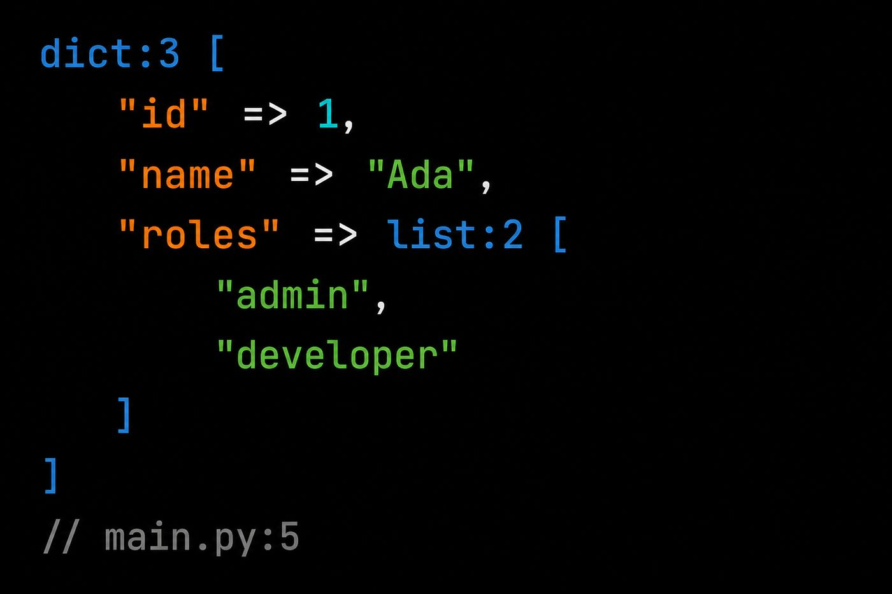

# pydump

**دامپ و توقف** ساختاریافته برای اسکریپت و CLI پایتون. فقط stdlib. بدون مرورگر و فریم‌ورک وب.

<figure class="shot" markdown>

<figcaption>درخت ترمینال رنگی — ANSI وقتی stderr یک TTY باشد</figcaption>
</figure>

## استک

برای پایتون خام. HTML در مرورگر می‌خواهید؟ از [pydd](https://ardavanshamroshan.github.io/pydd/) استفاده کنید.

<div class="grid cards fw-cards" markdown>

-   [{ .fw-logo }](getting-started.md)

    **[پایتون / CLI](getting-started.md)**

    فقط stdlib — اسکریپت، تست، CI

-   [{ .fw-logo }](https://ardavanshamroshan.github.io/pydd/)

    **[وب؟ → pydd](https://ardavanshamroshan.github.io/pydd/)**

    دامپ HTML برای FastAPI · Flask · Django

</div>

<div class="grid cards" markdown>

-   :material-download:{ .lg .middle } **نصب**

    ---

    `pip install pydump-dd`

    [:octicons-arrow-right-24: راهنمای نصب](installation.md)

-   :material-rocket-launch:{ .lg .middle } **شروع سریع**

    ---

    دامپ یک dict در سه خط.

    [:octicons-arrow-right-24: شروع سریع](getting-started.md)

-   :material-language-python:{ .lg .middle } **PyPI**

    ---

    نام بسته: **`pydump-dd`**

    [:octicons-link-external-24: pydump-dd در PyPI](https://pypi.org/project/pydump-dd/)

-   :material-github:{ .lg .middle } **گیت‌هاب**

    ---

    سورس، issue و مشارکت.

    [:octicons-link-external-24: ardavanshamroshan/pydump](https://github.com/ardavanshamroshan/pydump)

</div>

## مثال سریع

```python
import pydump  # dd/dump به builtins

user = {"id": 1, "name": "Ada", "roles": ["admin", "editor"]}
dump(user)   # stderr، ادامه اجرا
dd(user)     # stderr، سپس خروج 1
```

## پیش‌نمایش زنده

<figure class="shot" markdown>

<figcaption>درخت کامل — بدون UI جمع‌شدن در ترمینال</figcaption>
</figure>

<figure class="shot" markdown>

<figcaption>هدر تایپ‌شده، لیست تو در تو، نکتهٔ // file:line</figcaption>
</figure>

<figure class="shot" markdown>

<figcaption>درخت dict / list با رنگ‌های سینتکس</figcaption>
</figure>

## HTML / فریم‌ورک وب می‌خواهید؟

**[pydd](https://ardavanshamroshan.github.io/pydd/)** — pydump + دامپ HTML برای FastAPI، Flask و Django.

| نیاز | بسته | PyPI |
|------|------|------|
| فقط ترمینال | **pydump** | `pydump-dd` |
| اپ وب | [pydd](https://ardavanshamroshan.github.io/pydd/) | `pydd-web` |

## مجوز

MIT — [مخزن گیت‌هاب](https://github.com/ardavanshamroshan/pydump).
